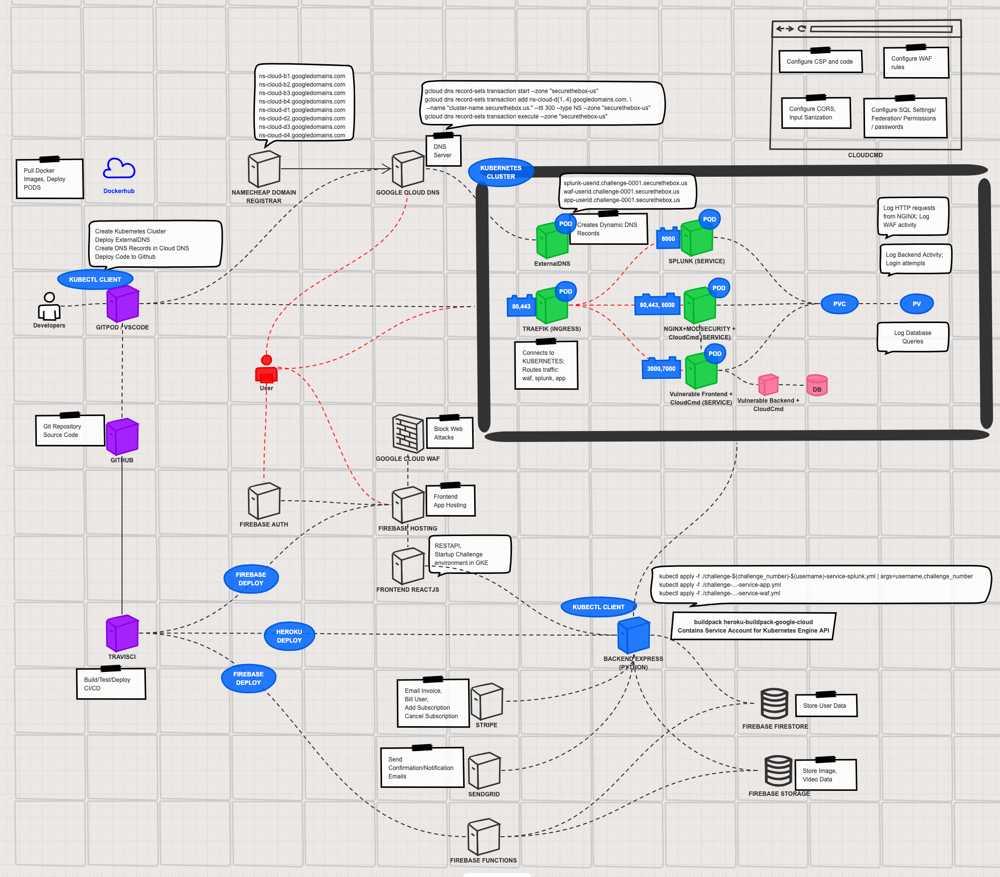

# securethebox master repository

*A platform to assess and measure security skills.*
Inspired by [gen0cide/h3](https://github.com/gen0cide/h3) a project made by Alex Levinson

# What's in this repository:
**securethebox-client**
- This is the Frontend of the Application using Admin Template

**securethebox-challenge**
- This is the MVP challenge (alpha version) using Dockerized environment
- View README.md inside directory for instructions for development environment setup

## P0 - MVP
**Planning**
- [x] System Design Infrastructure - <https://sketchboard.me/pBw3UcaTPKfb#/>
- [ ] Architecture Frontend Design Mockup
- [ ] API Specificiation Draft
- [ ] Firebase Functions Draft
- [ ] Challenge #1 - Application Security: SQL Injection Detection - On-Click Deploy to AWS ECS
- [ ] Challenge #1 - Application Security: SQL Injection Detection - Documentation Script
- [ ] Challenge #1 - Application Security: SQL Injection Detection - Documentation Video
- [x] First Customers Identified (Friends & Coworkers)

**Frontend**
- [x] React Template - Fuze
- [ ] Academy Page (10%)
- [x] Cloudcmd (Texteditor + Terminal) <http://cloudcmd.io/>
- [ ] Firebase Integration - Firebase Hosting

**Backend**
- [x] Docker - Traefik (Container Reverse Proxy) <https://hub.docker.com/_/traefik>
- [x] Docker - Nginx + Modsecurity (WAF Detection/Prevention) <https://hub.docker.com/r/ncmd/nginx-modsecurity>
- [ ] Docker - Splunk (Log Analysis) <https://hub.docker.com/r/splunk/splunk>
- [x] Docker - Juice-shop (Vulnerable App) <https://hub.docker.com/r/ncmd/juice-shop>
- [x] Docker - exec install cloudcmd and open port
- [ ] Nginx logs to splunk
- [ ] Modsecurity logs to splunk
- [x] Nginx forwarding traffic to vulnerable application (on juiceshop app) (100%)
- [ ] All containers Dockerized (80%)
- [x] Docker Network figured out (by traefik)
- [x] Routing traffic to proper container using traefik
- [x] Ability to modify vulnerable application code

**Challenges**
- [ ] SQL Injection Detection
- [ ] SQL Injection Prevention 
- [ ] Python Scripting
- [ ] Log Analysis

**Management**
- [x] Domain Registered
- [x] Automate DNS record provisioning using ExternalDNS

## P1
- [ ] Firebase Integration - Firestore
- [ ] Create an account with Email
- [ ] Verify Email Address
- [ ] Log out account
- [ ] Sign in with Email
- [ ] Cloudflare DNS & WAF on Frontend
- [ ] CI/CD with Travis - Firebase Hosting
- [ ] CI/CD with Travis - Heroku Backend
- [ ] Stripe Subscriptions

## P2
- [ ] Automated deployment
- [ ] Platform Self Service
- [ ] API to change rules in WAF
- [ ] CI/CD with Travis - Firebase Functions
- [ ] CI/CD with Travis - Dockerhub
- [ ] Create an account with OAuth2 (Google)
- [ ] Swagger API
- [ ] Sign in with Google
- [ ] Google Ads
- [ ] Amazon Ads
- [ ] Challenge #X - XXS Prevention 
- [ ] Challenge #X - Credential Stuffing Detection
- [ ] Challenge #X - Business Logic Attacks
- [ ] Challenge #X - CSP bypass detection
- [ ] Challenge #X - WAF bypass detection

## P3
- [ ] Twitter Created
- [ ] Achievements system
- [ ] Websocket Real-time updates
- [x] Discord Created
- [ ] Discord Mods
- [ ] Discord Channels - Important (Announcements, Rules, FAQ, Poll, Staff Voice, Server Announcements)
- [ ] Discord Channels - Challenge Discussions (General, Advice, Vote to Delist)
- [ ] Discord Channels - Feedback ()
- [ ] Discord Channels - Advertisements ()
- [ ] Discord Channels - Sponsorships ()
- [ ] Discord Channels - Patreons ()
- [ ] Discord Channels Voice (Clubs)

# Architecture Version 1
<p align="center">
	
</p>

# NOTES
- May need to switch to a Kubernetes setup if this does not work...
- Adding a Git Submodule example (DO NOT use this command if you do not know what you're doing...)
```
git submodule add https://github.com/ncmd/securethebox-challenge
```

**Traefik Setup**
- https://www.digitalocean.com/community/tutorials/how-to-use-traefik-as-a-reverse-proxy-for-docker-containers-on-ubuntu-18-04
```
docker network create challenge1
touch acme.json
chmod 600 acme.json
docker run -d \
  -v /var/run/docker.sock:/var/run/docker.sock \
  -v $PWD/traefik.toml:/traefik.toml \
  -v $PWD/acme.json:/acme.json \
  -p 80:80 \
  -p 443:443 \
  -l traefik.frontend.rule=Host:monitor.securethebox.us \
  -l traefik.port=8080 \
  --network challenge1 \
  --name traefik \
  traefik:1.7.10-alpine
```

**Getting shell of docker container:**
```
docker exec -it c71a87c88a1e /bin/bash
docker exec -it securethebox-challenge_nginx-modsecurity_1 /bin/sh
```

**Installing and Starting Cloudcmd on Alpine:**
```
docker exec -u root -it dcdd24377a97 npm install -g cloudcmd && cloudcmd --port 7000 --no-open
docker exec -u root -it dcdd24377a97 which cloudcmd
/usr/local/bin/cloudcmd
docker exec -u root -it dcdd24377a97 npm install -g forever
docker exec -u root -it dcdd24377a97 forever start /usr/local/bin/cloudcmd
```

**Open a new port 8080:8080 on Container container_id_01**
```
docker stop container_id_01
docker commit container_id_01 container_id_02
docker run -p 8080:8080 -td container_id_02
```

**Getting Network information of container:**
```
docker inspect container_id_here | grep IPAddressdocker
```

**Proxying port 8080 of host to port 80 on container**
```
docker run --name container_name -d -p 8080:80 container_image_name
```

**Setup Nginx Conf and Cloudcmd for nginx-modsecurity**
```
docker-compose up -d
docker cp ./nginx.conf securethebox-challenge_nginx-modsecurity_1:/etc/nginx/nginx.conf
docker exec -u root -it securethebox-challenge_nginx-modsecurity_1 cat /etc/nginx/nginx.conf
docker exec -u root -it securethebox-challenge_nginx-modsecurity_1 nginx -s reload
docker exec -u root -it securethebox-challenge_nginx-modsecurity_1 apk add nodejs nodejs-npm
docker exec -u root -it securethebox-challenge_nginx-modsecurity_1 npm install -g cloudcmd
docker exec -u root -it securethebox-challenge_nginx-modsecurity_1 npm install -g forever
docker exec -u root -it securethebox-challenge_nginx-modsecurity_1 forever start /usr/bin/cloudcmd --port 7000
docker exec -it securethebox-challenge_nginx-modsecurity_1 /bin/sh
```

**Install and Start Cloudcmd for juice-shop**
```
docker exec -u root -it securethebox-challenge_juice-shop_1 npm install -g cloudcmd
docker exec -u root -it securethebox-challenge_juice-shop_1 npm install -g forever
docker exec -u root -it securethebox-challenge_juice-shop_1 forever start /usr/local/bin/cloudcmd --port 7000
docker exec -it securethebox-challenge_juice-shop_1 /bin/sh
```

**juicebox setup**
```
docker run --rm -p 3000:3000 bkimminich/juice-shop
```

**nginx config**
```
server {
    listen       80;
    server_name  localhost;
    modsecurity on;
    location / {
        rewrite ^/juice-shop(.*) /$1 break;
        proxy_pass http://juice-shop:3000;
    }
    error_page   500 502 503 504  /50x.html;
    location = /50x.html {
        root   /usr/share/nginx/html;
    }
}
```