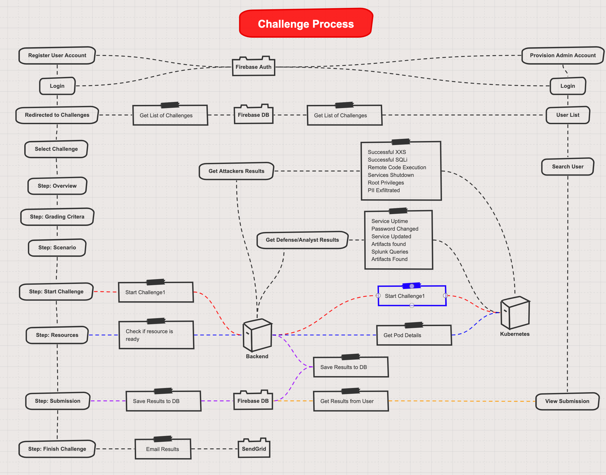

# SecureTheBox Master Repository

*A platform to assess and measure security **hard** skills.*
Inspired by [gen0cide/h3](https://github.com/gen0cide/h3) a project made by Alex Levinson

# What's in this repository:
**securethebox-client**
- This is the Frontend of the Application using Fuse Admin Template

**securethebox-server**
- Hosted on Heroku
- Python/Flask App
- Used as a REST API
- Has a gcloud + kubectl

**securethebox-challenge (deprecated)**
- This is the MVP challenge (alpha version) using Docker-Compose environment
- View README.md inside directory for instructions for development environment setup

## P0 - MVP
### **Planning**
- [x] System Design Infrastructure - <https://sketchboard.me/pBw3UcaTPKfb#/>
- [x] Challenge Process - <https://sketchboard.me/lBzYpOvyDoGv#/>
- [ ] Challenge #1 - Exfiltration (Detection, Prevention, Monitoring)
- [x] First Customers Identified (Friends & Coworkers)

### **Frontend**
- [x] **React Template**
    - [x] Fuze <https://themeforest.net/item/fuse-react-react-redux-material-design-admin-template/21769397?s_rank=2>
- [ ] **Academy Page**
    - [x] **Overview**
    - [x] **Grading Critera**
    - [ ] **Scenario**
        - [x] Description
        - [ ] Architecture
    - [x] **Start Challenge**
        - [x] Start Challenge
        - [x] End Challenge
    - [ ] **Resources**
        - [x] Name
        - [x] Description
        - [ ] Status
        - [x] URLS
    - [x] **Submission Answers**
        - [x] To Firebase Firestore DB
    - [ ] **Email Results**
        - [ ] SendGrid
- [x] **Ability to edit Application code**
    - Cloudcmd (Texteditor + Terminal) <http://cloudcmd.io/>
- [x] **Firebase Integration**
    - Firebase Hosting (React app in production)

### **Backend**
- [ ] **Python/Flask**
    - [x] Flask RESTAPI created
- [ ] **Heroku**
    - [x] Heroku Server has gcloud+kubectl+service account
    - [x] Able to execute Kubectl commands over RESTAPI
    - [x] Cloudcmd exec install cloudcmd and open port
- [ ] **Kubernetes**
    - [x] Traefik: Routing traffic to proper container 
    - [ ] Namespace + Networking segmented per user/challenge
    - [x] Nginx logs to pvc
    - [x] Modsecurity logs to pvc
    - [x] Splunk Forwarder injects logs in pvc
    - [x] Splunk Universal Forwarder send logs to Splunk
    - [x] Nginx forwarding traffic to vulnerable application (on juiceshop app) (100%)
    - [x] Ability to modify vulnerable application code using Cloudcmd
    - [x] Dynamic YAML files for Kubectl deployments
    - [ ] Add wireshark with xpra
- [ ] **Google Cloud**
    - [x] Google Service Account Provisioned for Heroku Server
    - [x] External-DNS create DNS records dynamically
- [ ] **Docker**
    - [x] Traefik (Container Reverse Proxy) <https://hub.docker.com/_/traefik>
    - [x] Nginx + Modsecurity (WAF Detection/Prevention) <https://hub.docker.com/r/ncmd/nginx-modsecurity>
    - [x] Juice-Shop (Vulnerable App) <https://hub.docker.com/r/ncmd/juice-shop>
    - [x] Splunk (Log Analysis) <https://hub.docker.com/r/splunk/splunk>
- [ ] **Business Logic**
    - [ ] Send Invite to User Email
    - [ ] Scoring engine

**Challenges**
- [ ] SQL Injection Detection
- [ ] SQL Injection Prevention 
- [ ] Python Scripting
- [ ] Log Analysis

**Management**
- [x] Domain Registered
- [x] Automate DNS record provisioning using ExternalDNS

## P1
- [ ] Traefik - All http traffic forced to SSL/TLS
- [x] Create an account with Email using Firebase
- [x] Sign in with Email using Firebase
- [ ] Verify Email Address
- [ ] Stripe Subscriptions
- [x] Log out account using Firebase

- [x] Firebase Integration - Firestore
- [ ] Cloudflare DNS & WAF on Frontend
- [ ] CI/CD with Travis - Firebase Hosting
- [ ] CI/CD with Travis - Heroku Backend


## P2
- [ ] Architecture Frontend Design Mockup
- [ ] API Specificiation Draft
- [ ] Firebase Functions Draft
- [ ] Automated deployment
- [ ] Platform Self Service
- [ ] API to change rules in WAF
- [ ] CI/CD with Travis - Firebase Functions
- [ ] CI/CD with Travis - Dockerhub
- [ ] Create an account with OAuth2 (Google)
- [ ] Swagger API
- [ ] Sign in with Google
- [ ] Google Ads
- [ ] Amazon Ads
- [ ] Challenge #X - XXS Prevention 
- [ ] Challenge #X - Credential Stuffing Detection
- [ ] Challenge #X - Business Logic Attacks
- [ ] Challenge #X - CSP bypass detection
- [ ] Challenge #X - WAF bypass detection

## P3
- [ ] Challenge #1 - Application Security: SQL Injection Detection - Documentation Script
- [ ] Challenge #1 - Application Security: SQL Injection Detection - Documentation Video
- [ ] Twitter Created
- [ ] Achievements system
- [ ] Websocket Real-time updates
- [x] Discord Created
- [ ] Discord Mods
- [ ] Discord Channels - Important (Announcements, Rules, FAQ, Poll, Staff Voice, Server Announcements)
- [ ] Discord Channels - Challenge Discussions (General, Advice, Vote to Delist)
- [ ] Discord Channels - Feedback ()
- [ ] Discord Channels - Advertisements ()
- [ ] Discord Channels - Sponsorships ()
- [ ] Discord Channels - Patreons ()
- [ ] Discord Channels Voice (Clubs)

# Architecture Version 3
<p align="center">
	
</p>

# Challenge Process Version 1
<p align="center">
	
</p>

# NOTES
- Adding a Git Submodule example (DO NOT use this command if you do not know what you're doing...)
```
git submodule add https://github.com/ncmd/securethebox-challenge
```

